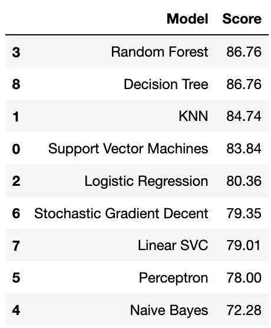

## Goal

Predict **if a passenger survived the sinking of the Titanic or not**.
For each in the test set, you must predict a 0 or 1 value for the variable.

## Metric

Your score is the percentage of passengers you correctly predict. This is known simply as **accuracy**.

## Submiission File Format

The file should have exactly 2 columns:
- PassengerId (sorted in any order)
- Survived (contains your binary predictions: 1 for survived, 0 for deceased)

```
PassengerId,Survived
 892,0
 893,1
 894,0
 Etc.
 ```

 ## Official Solutions

 [https://www.kaggle.com/startupsci/titanic-data-science-solutions](https://www.kaggle.com/startupsci/titanic-data-science-solutions)

 ### Best Practice

- Performing feature correlation analysis early in the project.
- Using multiple plots instead of overlays for readability.

### Model and Prediction

