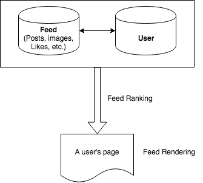

# Flow

## A. Understand the problem and scope

- Define the use cases, with interviewer's help.
- Suggest additional features.
- Remove items that interviewer deems out of scope.
- Assume high availability is required, add as a use case.

## B. Think about constraints

- Ask how many requests per month.
- Ask how many requests per second (they may volunteer it or make you do the math).
- Estimate reads vs. writes percentage.
- Keep 80/20 rule in mind when estimating.
- How much data written per second.
- Total storage required over 5 years.
- How much data reads per second.

## C. Abstract design

- Layers (service, data, caching).
- Infrastructure: load balancing, messaging.
- Rough overview of any key algorithm that drives the service.
- Consider bottlenecks and determine solutions.

Source: https://github.com/jwasham/coding-interview-university#system-design-scalability-data-handling

# Grading Rubrics

- Problem Solving - How systematic is your approach to solving the problem step-by-step? Break down a problem into its core components.
- Communication - How well do you explain your idea and communicate it with others?
- Evaluation - How do you evaluate your system? Are you aware of the trade-offs made? How can you optimize it?
- Estimation - How fast does your system need to be? How much space does it need? How much load will it experience?

# System Design Topics

- Vertical scaling
- Horizontal scaling
- Caching
- Load balancing
- Database replication
- Database partitioning

# Google Search是如何实现的

## 搜索词解析

利用语言模型把搜索关键词分解为可以在索引中查询(lookup)的词。

# Facebook News Feed Design 信息流设计

[News feed](https://www.google.com/search?q=what+is+facebook+news+feed&oq=what+is+facebook+news+feed&aqs=chrome..69i57j0l2j69i60j0l2.4023j0j1&sourceid=chrome&ie=UTF-8)就是在你的主页上出现的一系列的文章、视频、图片、评论、点赞等。

基本流程如图：

## Requirements Gathering 需求收集

- **目标平台**：手机，网络，电脑桌面
- **需要什么特征？**
    - CRUD posts
    - Commenting on posts
    - Sharing posts
    - Trending posts
    - Tag People
    - Hashtags
- **什么是一个news feed post?**
    - 作者、内容、媒体、Tags、Hashtags、评论、回复、操作（CRUD, 评论/回复）
- **什么是一个news feed?**
    - Sequence of posts
    - Query pattern: query for a user's ranked news feed
    - Operations:
        - Append: fetch more posts.
        - Delete: I don't want to see this.
- **度量标准**
    - User retention
    - Ads revenue
    - Fast loading time
    - Bandwidth
    - Server costs

## Data Modelling 数据模型

- **使用什么样的数据库?**
    - 数据是结构化的
- **设计必要的数据表，及其关系**
    - `users`, `posts`, `likes`, `follows`, `comments`
    - 基本类型`users`: 对于每一个用户，我们可以存储userID，name, registration date等。
    - 基本类型`feed`: 对于feed类型，可以存feedId, feedType, content, metadata等。
    - 基本关系：`user-feed`关系和`friend`关系。

## Feed Display 信息流展示

最简单的方法就是把你follow的所有朋友的posts全部取出来，并按照时间顺序排列。但问题是：
- 展示多少posts？
- 如何分页，各有什么优缺点？
- 哪些有关于post的数据需要被获取？Lazy loading approach? 
- 如果post中包含图片或视频，它们应该怎么处理？ 
- posts中的评论如何获取？名人文章的评论可能会包含成百上千的评论。
- 用户如何获取新的内容？向下无限滚动？还是点击next？

## Feed Ranking 信息流排序

- 选择设计影响排序的特征/信号
- 如何向用户展示相关或者感兴趣的posts
    - 按时间排序（Chronological）：不太合适，假设有用户在半个小时之内发布了30篇文章，那么他的关联朋友会看到一堆他的文章。
    - 按热度排序（Popularity）
- 怎么定义哪篇文章更重要？通常是定义一系列特征来对posts进行排序，比如2013年以前，Facebook采用EdgeRank算法来决定哪些文章将被展示在用户的timeline上。
- **EdgeRank**算法主要包含三类基本信号：`affinity score`, `edge weight`和`time deca`, `edge weight`和`time decay`. 

## Additional Features 附加的功能

- **Tagging feature**
- **Sharing feature**
- **Notifications feature**
- **Trending feature**
- **Search feature**

## Scalability 

-**Master-slave replication**
    - Write to master database and read from replica databases/in-memory data store.
    - Post contents are being read more than they are updated. It is acceptable to have a slight lag between a user updating a post and followers seeing the updated content. Tweets are not even editable.
- Data for real-time queries should be in memory, disk is for writes only.
- Pre-computation offline.
- Tracking number of likes and comments
    - Expensive to do a `COUNT` on the `likes` and `comments` for a post.
    - Use Redis/Memcached for keeping track of how many likes/comments a post has. Increment when there's new activity, decrement when someone unlikes/deletes the comment.
- Load balancer in front of your API servers.
- Partitioning the data.
