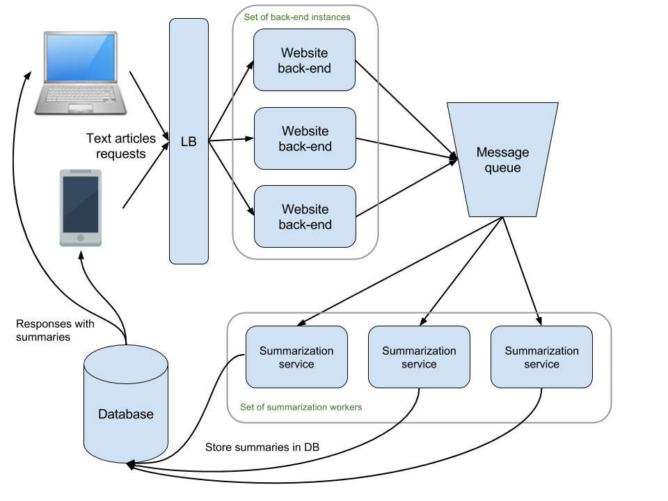
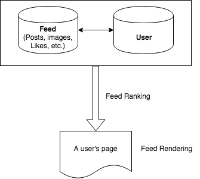
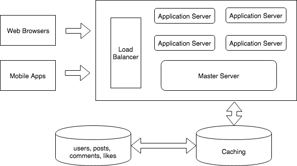

# Flow

## A. Understand the problem and scope

- Define the use cases, with interviewer's help.
- Suggest additional features.
- Remove items that interviewer deems out of scope.
- Assume high availability is required, add as a use case.

## B. Think about constraints

- Ask how many requests per month.
- Ask how many requests per second (they may volunteer it or make you do the math).
- Estimate reads vs. writes percentage.
- Keep 80/20 rule in mind when estimating.
- How much data written per second.
- Total storage required over 5 years.
- How much data reads per second.

## C. Abstract design

- Layers (service, data, caching).
- Infrastructure: load balancing, messaging.
- Rough overview of any key algorithm that drives the service.
- Consider bottlenecks and determine solutions.

Source: https://github.com/jwasham/coding-interview-university#system-design-scalability-data-handling

# Grading Rubrics

- Problem Solving - How systematic is your approach to solving the problem step-by-step? Break down a problem into its core components.
- Communication - How well do you explain your idea and communicate it with others?
- Evaluation - How do you evaluate your system? Are you aware of the trade-offs made? How can you optimize it?
- Estimation - How fast does your system need to be? How much space does it need? How much load will it experience?


# Preliminary Knowledge 

## Basic Statistics

- Active users of FB: **1.3 billion**
- Active users of Twitter: **650 million**, new tweets made per day: **500 million** (15 billion per month)


## System Design Topics

- **Vertical scaling**：可以通过增加资源来进行扩展，通常意味着数据在单机上。
- **Horizontal scaling**: 可以通过增强机器来进行扩展，通常这是基于数据分片(data partitioning)。
- **Caching**：设计一个缓存系统需要考虑以下几点：
    - Read/write speed
    - Memory usage
    - Disk I/O dumping
    - Scaling
- Load balancing
- Database replication
- Database partitioning
    - Partitioning of relational data usually refers to decomposing your tables either row-wise (horizontally) or column-wise (vertically).
- Data Denormalization: [intro](https://www.geeksforgeeks.org/denormalization-in-databases/)
    - Pros: Less table joins, faster query retrieval; Queries can be simpler
    - Cons: Updates and inserts are more expensive; Denormalization can make update and insert code harder to write; Data may be inconsistent.

[system-design-cheatsheet](https://gist.github.com/vasanthk/485d1c25737e8e72759f)

### Tutorials

- [System Design Interview Course](https://www.hiredintech.com/classrooms/system-design/lesson/53)
- Scalabilty for dummies 
    - [Clones](http://www.lecloud.net/post/7295452622/scalability-for-dummies-part-1-clones): 处理海量请求时，采用clones，由负载均衡(load balancer)负责把用户的请求分发到空闲的机器上，每台机器需要有相同的code base，而任何用户相关的数据，比如sessions, profile pictures，需要被放到外部的公共可访问的persistent cache，比如redis. 
    - [Database](http://www.lecloud.net/post/7994751381/scalability-for-dummies-part-2-database): 不要采用MySQL, 因为会涉及到很多数据表的joins，引发性能下降，而采用NoSQL，比如MongoDB。
        - 可能涉及到的技术: sharding, denormalization, SQL tuning
    - [Cache](http://www.lecloud.net/post/9246290032/scalability-for-dummies-part-3-cache): 使用基于内存的cache，比如Memcached或者是redis，永远不要用基于文件的cache。
        - 基本知识：redis每秒读写操作数
        - 缓存方式一 Cached Database Objects：每次对数据库进行查询，就把对应的查询结果缓存。下一次再遇到同样的query，先检查是否在cache中。这种缓存方式的问题是有效期expiration。什么时候把缓存结果删除？比如一个复杂query的结果。以及如果某部分查询结果发生变化，比如一个table cell，是否需要删除所有与之相关的缓存结果？
        - 缓存方式二Cached Objects：比如user sessions, fully rendered blog articles, activity streams, user-friend relationships。
    - [Asynchronism](http://www.lecloud.net/post/9699762917/scalability-for-dummies-part-4-asynchronism)
        - 异步方式一：把time-consuming的任务放到服务比较闲暇之时做，这样可以减少响应时间。
        - 异步方式二：有些请求无法被提前预见，因此无法像方式一那样进行预计算，方式二就是任务的异步操作。

## How to deal with Outliers in the data

Caching

Auto-scaling: Amazon, Heroku 


## Real Life Examples

[hiredintech](https://www.hiredintech.com/classrooms/system-design/lesson/61)
[How big companies use relational databases](https://www.hiredintech.com/classrooms/system-design/lesson/69)

- Twitter: real time feed of the tweets by the people you’re following
- Google: instantly returning the pages matching any search query (Search)
- Youtube: Storing and serving massive amounts of video data 
- Google News: Aggregating the world’s news by topic
- Facebook: serving massive amounts of photos

# Latest Technologies and Common Patterns

## Modern Web Frameworks && How They Work

Node.js, Ruby on Rails, Angular.js, Ember.js. React.js

### Message Queue

Message queues are typically (but not always) ‘brokers’ that facilitate message passing by 
providing a protocol or interface which other services can access. This interface connects producers which create messages and the consumers which then process them.

The easiest place to start is to explain the emerging open standard protocols for message queues which are AMQP and STOMP. These are the most popular message queue standards around today and many of the message queues implement one or both of these protocols.

RabbitMQ, PostgreSQL, Kafka

# Task 1: Design a URL Shortening Service

md5, convert to base 62

# Task 2: Design a simplified version of Twitter

Design a simplified version of Twitter where people can post tweets, follow other people and favorite tweets. 

## Clarify Questions 定义问题，收集需求

- How many users do we expect this system to handle?  `10 million users, 100 million requests per day`
- How connected will these users be? `follow 200 users on average`
- How many tweets a day, and in what percentage do they get "favorite"?  `10 million tweets per day, each tweet be favorited twice on average`
- How long can a tweet be?
- What content can a user tweet, text, images, videos?


- **Summary**
    - The user graph is with `10 million` nodes and `2 billion` edges (connections).
    - `10 million` tweets per day, `20 million` favorited tweets. 

## Abstract Design 抽象设计/顶层设计

可以分为两个部分：
- 逻辑层（Logic Layer）
    - 需要处理需求：`发布新tweet`, `喜欢tweet`, `follow用户`，`显示用户和tweets`。其中，前三项是写需求，最后一项是读需求，也是最频繁的需求。每天`100 million`的请求，相当于每秒`1150`个请求。
    - 如何与前端交互：RESTful API
        - `GET /api/users/<username>`: 返回特定用户相关的profile。
        - `GET /api/users/<username>/tweets`: 返回特定用户发布的tweets。或是以页分隔`GET /api/users/<username>/tweets?page=4`.
        - `GET /api/users/<username>/followers`和`GET /api/users/<username>/followees`：用户关注关系。
        - `POST /api/users/<username>/tweets`：发布新tweets。
        - `POST /api/users/<username>/followers`：关注用户。
        - `GET /api/users/<username>/tweets/<tweet_id>/favorites`: 喜欢一个tweet的用户。
        - `POST /api/users/<username>/tweets/<tweet_id>/favorites`：喜欢一个tweet。
    
- 数据层（Data Layer）
    - 数据：`tweets`，`users`, `favorites`. 它们的关系如下图，一个用户可以有多条tweets，也可以对多条tweets表示喜欢。用户之间是多对多的follow关系。
    - 数据存储：如果设计成关系型数据库，那么有一张`users`表，其中的列包括`userid`, `username`, `registration_date`, `password`, `email`, `devices`, etc. 另有一张`tweets`表，列包括
    `tweet_id`, `content`, `published_by`等，其中`publish_by`对应的是`userid`。还有可能有一张`favorite`表，存储的是`userid`, `tweet_id`和`create_time`. 还有一张表存储的是用户互相关注的
    信息，比如`userid`, `userid`, `follow_at`. 
- 性能
    - 缓存机制（Caching）
    - 索引（Indexes） 
    - 数据分片（Data Partitioning）
 - 可能的扩展思考
    - Think about supporting a page, which shows for a given user a list of recent tweets that this user either authored or favorited, ordered by date of creation.
    - For a given user A build a page showing the recent tweets authored by users that A is following. What would the query be, which indexes will it use and does it need more indexes to be added?
    - 如果用户访问请求加倍，哪一块会首先成为瓶颈？怎么解决？
        - Database首先会成为瓶颈。replication, sharding. [experiences from Instagram and Flickr](https://www.hiredintech.com/classrooms/system-design/lesson/73)
    


#  Task 3: Text Summarization

[problem statement](https://www.hiredintech.com/classrooms/system-design/lesson/101)

## Clarify Questions 定义问题，收集需求

- `1 million requests a month`： `0.38` times per second
- Questions:
    - `What is the expected maximum number of simultaneous requests?` => `up to 50 requests per second`
    - `Do you want to store the results of the processing for a longer period of time?` => `yes`
    - `What is the expected way of presenting the results within the website and the mobile app` => `a page to show the progress, present when finished`
    - `The size of the text articles` => `We will limit the size of the text articles to be no more than 100 KB. The summaries are meant to be no more than 1KB in size`
    - `How will the date be used?` => `use the stored data to analyze the accuracy of our algorithms and also for some statistical goals. We will also want to show to our customers a history of their requests and the summaries that they received`
- Storage
    - 存储量：`100 KB * 1 million requests` = `100 GB` per month = `1.2 TB` per year
    
## Abstract Design 抽象设计/顶层设计

- Message Queue to handle requests
- Store the results


    
# Task 4: Google Search是如何实现的

## 搜索词解析

利用语言模型把搜索关键词分解为可以在索引中查询(lookup)的词。


# Task 5: Facebook News Feed Design 信息流设计

[News feed](https://www.google.com/search?q=what+is+facebook+news+feed&oq=what+is+facebook+news+feed&aqs=chrome..69i57j0l2j69i60j0l2.4023j0j1&sourceid=chrome&ie=UTF-8)就是在你的主页上出现的一系列的文章、视频、图片、评论、点赞等。


## Requirements Gathering 需求收集

- **目标平台**：手机，网络，电脑桌面
- **需要什么特征？**
    - CRUD posts
    - Commenting on posts
    - Sharing posts
    - Trending posts
    - Tag People
    - Hashtags
- **什么是一个news feed post?**
    - 作者、内容、媒体、Tags、Hashtags、评论、回复、操作（CRUD, 评论/回复）
- **什么是一个news feed?**
    - Sequence of posts
    - Query pattern: query for a user's ranked news feed
    - Operations:
        - Append: fetch more posts.
        - Delete: I don't want to see this.
- **度量标准**
    - User retention
    - Ads revenue
    - Fast loading time
    - Bandwidth
    - Server costs
- **基本数据 Statistics**
    - Facebook feed scale: `10 billion requests a day` in 2012
        - Photo uploads total `300 million` per day.
        - Every `60 seconds` on Facebook: `510,000 comments` are posted, `293,000 statuses` are updated, and `136,000 photos` are uploaded.
        - Average user creates `90` pieces of content per month
    - Facebook user scale: 
        - `2.2 billion monthly active users`
        - `1.15 billion daily mobile active users`
        - `5` new profiles created per second
        - Average number of friends per user is `338`, median value is `200`.
    - Summary: 假设每天新增的posts为`100 million per day`，包括status, articles, etc. 假设一篇post不包含图片和视频，近包含文字，假设一篇文章不超过1000个字符，每个字符占2个byte，
        那么每天需要存储`200GB`的数据，每年就是`73TB`.
- **基本模块**
    - 逻辑组成：`user`, `posts`, `comments`, `likes`。
    - 服务构成：
        - `发布feed`，`查询feed`，`展示feed`，`评论feed`，`转发feed`，`喜欢feed`，和`关注其他用户`。 
    
## Abstract Design 抽象设计/顶层设计

基本流程如图：



- News Feed系统如何使用？
    - 有两种方式：**Push** vs. **Pull**
        - **Push**: 只要用户有的新的更新，就写到相关用户的流里，用户只需读取一次。
        - **Pull**: 在用户获取时读取feed数据。因此，写操作只进行一次，读操作可能涉及多表的合并查询。
    

把这个大的系统设计问题分解成子问题。仅看后端设计，包含三个子问题：
- **数据模型**: 需要有某种方式来保存用户数据和feed数据，数据模型会根据需求而不同，同时也会影响数据的读写效率。
- **Feed排序**: 对于每个用户，可能有成百上千的feed内容，选择哪些重要的排在前面优先给用户看到就是feed排序的任务。
- **Feed发布**: 海量用户的时候，规模是个问题。



### Data Modelling 数据模型

- **使用什么样的数据库?**
    - 数据是结构化的
    - **Naive solution**: RDBMS, single-table, vertically scaled, Master-slave replication and Memcached for read throughput [twitter](https://www.slideshare.net/nkallen/q-con-3770885/9-Original_Implementation_MasterSlave_Replication_Memcached)
        - Problems: 磁盘存储有限，容量难以扩展
    - **Partition solution**: 根据`feed_id`, `user_id`, 或者`time`来做数据分片，查询需要对多个partitions做
        - 重点：Partition and Index, Exploit for **Locality** (比如，时间上的locality，这样很可能只需要对一个partition做查询)
        - Problems: Write throughput, deadlocks in MySQL
    - **Better solution**
        - 重点：NoSQL, Primary key partitioning, manual secondary index on `user_id`. 
- **可能需要处理的查询需求**
    - 获取任意两个用户之间的共同用户，确认两者之间是否是朋友关系，获取一个用户的所有朋友。
    - 获取一个用户的所有feed，获取一个用户的posts，获取一个用户的status。
    - 获取一个feed的状态，发布时间，内容，喜欢的用户
- **设计必要的数据表，及其关系**
    - Feeds的特点：按类型合并，按rank排序
    - `users`, `posts`, `likes`, `follows`, `comments`
    - 基本类型`users`: 对于每一个用户，我们可以存储userID，name, registration date等。
    - 基本类型`feed`: 对于feed类型，可以存feedId, feedType, content, metadata等。
    - 基本关系：`user-feed`关系和`friend`关系。

### News Feed API 设计

- 确认两者之间是否是朋友关系
    - 方法名：`IsFriend`， 参数为`user_id1, user_id2`, 其中`userid1`和`userid2`分别是两个用户的id。
    - 返回：`true`或者`false`.
- 获取任意两个用户之间的共同用户
    - 方法名：`GetCommonFriends`，参数为`user_id1, user_id2`
- 获取一个用户的所有朋友
    - 方法名：`GetAllFriends`，参数为`user_id`
- 获取用户的feed内容
    - 方法名：`GetUserFeed`
    - 参数：
        - `user_id`: 当前请求用户的id.
        - `count`: 单次返回的记录数，最大为100，默认20.
        - `offset`: 返回结果的偏移，默认为0.
    - 返回：
        ```[
            {"create_time": "Tue May 31 17:46:55 +0800 2011"},
            "feed_id": "123", 
            "comment_count": 9,
            "repost_count": 2,
            "favorited_count": 1,
            "content": ""
            ]
         ``` 
   - 问题：
        - 返回多少个records?
        - 如果feed是按照ranking结果而非按照时间来排序的，怎么办呢？
- 获取某条feed的comment
    - 方法名：`GetFeedAction`
    - 参数：
        - `type=comment`：行为的类别，此处是comment.
        - `count`：单次返回的记录数，默认20.
        - `offset`：返回结果的偏移，默认为0.
    - 返回：
    ```
        [
            "feed_id": "123",
            "action_type": "comment",
            "action_id": "456",
            "action_quote": "this is good",
            "create_time": "***"
        ]
    ```

### Feed Display 信息流展示

最简单的方法就是把你follow的所有朋友的posts全部取出来，并按照时间顺序排列。但问题是：
- 展示多少posts？
- 如何分页，各有什么优缺点？
- 哪些有关于post的数据需要被获取？Lazy loading approach? 
- 如果post中包含图片或视频，它们应该怎么处理？ 
- posts中的评论如何获取？名人文章的评论可能会包含成百上千的评论。
- 用户如何获取新的内容？向下无限滚动？还是点击next？
- 如果获取用户的所有feeds，那么可能需要最少两张表（friends list和feed list）的join。


### Feed Ranking 信息流排序

- 选择设计影响排序的特征/信号
    - **Connection Feature**: `is friend`, `degree of connection`
    - **Interaction Feature**: `visit other's profile`, `like other's posts`, `comment on other's posts/status`, `tag other`, `be tagged`, 
        `how other people interact with this post`, `do many of your friends/people post the same thing`   
    - **Preference Feature**: `the type of post you usually engage`
    - **Temporal Feature**: `the created time of the post`, `have you seen the post`   
- 如何向用户展示相关或者感兴趣的posts
    - 按时间排序（Chronological）：不太合适，假设有用户在半个小时之内发布了30篇文章，那么他的关联朋友会看到一堆他的文章。
    - 按热度排序（Popularity）
- 怎么定义哪篇文章更重要？通常是定义一系列特征来对posts进行排序，比如2013年以前，Facebook采用EdgeRank算法来决定哪些文章将被展示在用户的timeline上。
- **EdgeRank**算法主要包含三类基本信号：`affinity score`, `edge weight`和`time deca`, `edge weight`和`time decay`. 
    - `affinity score`: explicit interactions like comment, like, tag, share, click, time factor, etc.
- **排序模型** [LTR简介](https://zhuanlan.zhihu.com/p/26539920) [LTR基础](http://59.108.48.12/lcwm/course/WebDataMining/slides2012/8%E6%9C%BA%E5%99%A8%E5%AD%A6%E4%B9%A0%E5%8F%8A%E6%8E%92%E5%BA%8F%E5%AD%A6%E4%B9%A0%E5%9F%BA%E7%A1%80.pdf)
    - 训练数据生成
        - 从用户点击记录(query log)里抽取数据标注，存在问题：用户点击有比较大的噪声，只有head query才有点击
    - 特征抽取
    - 模型构建
        - **Classification**问题
            - 假设训练数据只有click log，无人工标注问题，那
        - **RankSVM** (Pairwise)
            - 目标：学习一个线性排序函数f(x) = w · x，如果x<sub>i</sub>比x<sub>j</sub>更相关，那么f(x<sub>i</sub>) > f(x<sub>j</sub>)，也就是(w, x<sub>i</sub> - x<sub>j</sub>) > 0.
            - 转化成分类问题：(x<sub>i</sub> - x<sub>j</sub>, y)，如果x<sub>i</sub> > x<sub>j</sub>, y = 1，否则y = -1.
        - LambdaMART (Listwise)
        - RankNet (Pairwise)
- **评价指标**
    - 分类
        - Accuracy: `(TP+TN)/(TP+TN+FP+FN)`
        - Precision: `TP/(TP+FP)`
        - Recall: `TP/(TP+FN)`
        - F1 score: `2 * P * R / (P + R)`
        - ROC Curve
        - PR Curve
        - AUC
    - 回归：
        - MAE 
        - 均方误差MSE
    - MAP (Mean Average Precision)
    - NDCG (Normalized Discounted Cumulative Gain)
    - Page View
    
        
    
### Additional Features 附加的功能

- **Tagging feature**
- **Sharing feature**
- **Notifications feature**
- **Trending feature**
- **Search feature**

### 可能的问题

1. input/output是什么
2. feed里图片怎么存
3. friends怎么存
4. 怎么做multi device sync


## Scalability 

-**Master-slave replication**
    - Write to master database and read from replica databases/in-memory data store.
    - Post contents are being read more than they are updated. It is acceptable to have a slight lag between a user updating a post and followers seeing the updated content. Tweets are not even editable.
- Data for real-time queries should be in memory, disk is for writes only.
- Pre-computation offline.
- Tracking number of likes and comments
    - Expensive to do a `COUNT` on the `likes` and `comments` for a post.
    - Use Redis/Memcached for keeping track of how many likes/comments a post has. Increment when there's new activity, decrement when someone unlikes/deletes the comment.
- Load balancer in front of your API servers.
- Partitioning the data.
