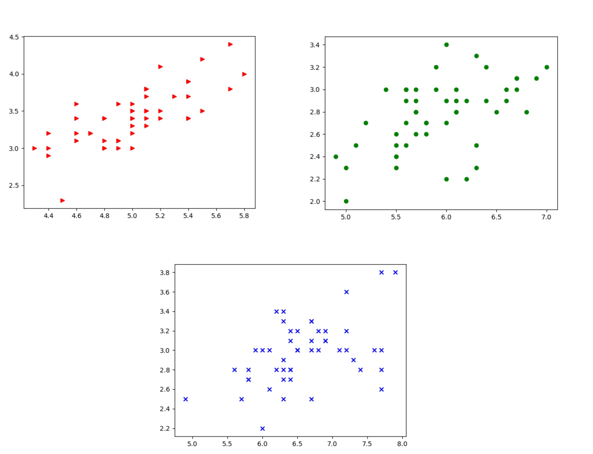

## Day 1: How to build a machine learning system

### Visualization

```python
from sklearn.datasets import load_iris
from matplotlib import pyplot as plt
import numpy as np

# load the data with load_iris from sklearn
data = load_iris()
features = data['data']
feature_names = data['feature_names']
target = data['target']

for t,marker,c in zip(xrange(3),">ox","rgb"):
    # plot each class on its own to get different colored markers
    # plt.scatter(features[target == t,0],
    features[target == t,1],
    marker=marker,
    c=c)
```


```python
target_names = data['target_names']
labels = target_names[target]

plength = features[:, 2]
# use numpy operations to get setosa features
is_setosa = ('target_names' == 'setosa')
# This is the important step:
max_setosa =plength[is_setosa].max()
min_non_setosa = plength[~is_setosa].min()
print('Maximum of setosa: {0}.'.format(max_setosa))
print('Minimum of others: {0}.'.format(min_non_setosa))
```
结果为**Maximum of setosa: 1.9. Minimum of others: 3.0.**。

## Day 2: Logistic Regression 逻辑回归

**Completion time**: `35 hours`

Refer: [https://metacademy.org/graphs/concepts/logistic_regression](https://metacademy.org/graphs/concepts/logistic_regression)


